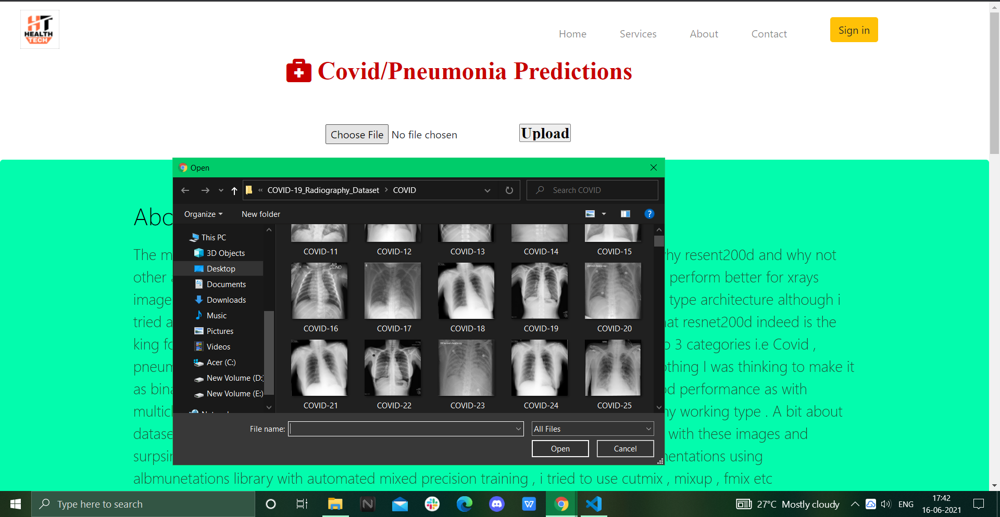
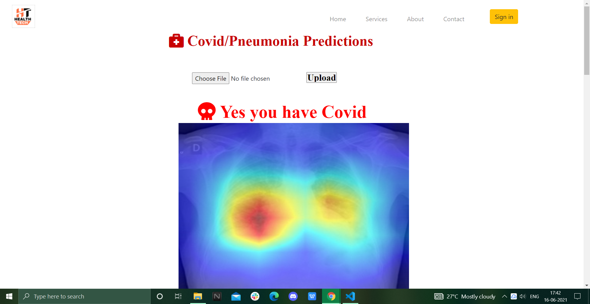

# Health-Tech
This repository is the source code of Health Tech which is an AI based Healtcare startup we are trying to minimize the problems caused by diseases by early detecting them and giving you the best solution and advice .Our main aim is to revolutrionize  the health care facilities in todays world by the help of AI . Our motto is AI for Health . 

# Services we provide :- 
### 1. Disease classification / Detection using Medical imaging
### 2. Early Detection of chronic diseases such as brainstoke / Heart attack through your daily diet / habbits 
### 3. Disease localization in your body 

# How to check :- 
#### Step 1. Go to services 
#### Step 2. Choose any service
#### Step 3. Suppose you choose covid detection then select to choose file option 

#### Step 4. Click on upload and you will get the result 

# Updates :-

## June 14, 2021
#### > Fixed the bug while uploading images for prediction 
#### > Covid model switched to resnet18d from previous resnet200d as git lfs has modified the weights of 200d while uploading .
